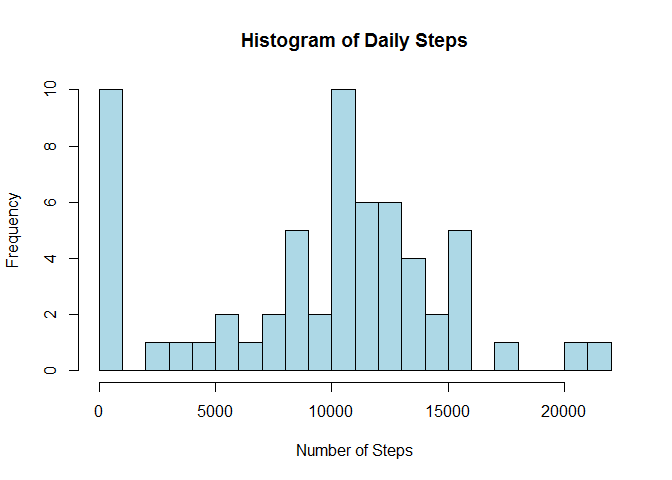
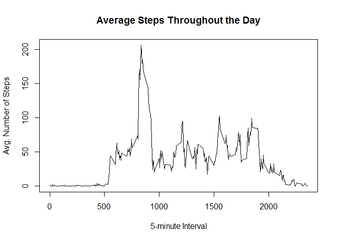
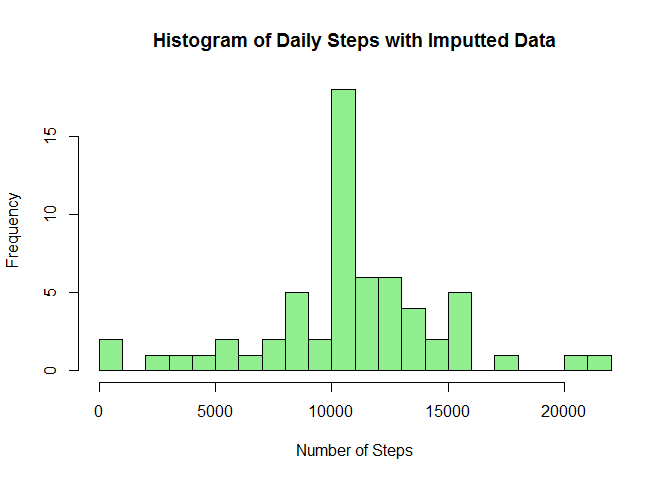
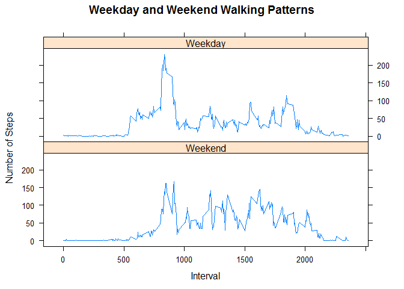

# Reproducible Research: Peer Assessment 1

## Loading and preprocessing the data
### 1. Load the data 

Clear the working space, unzip the file and create a data frame (df) with which
to work


```r
rm(list=ls())
unzip("activity.zip")
df <- read.csv("activity.csv")
```

### 2. Process/transform the data 

Assign date values to the date column


```r
df$date <- as.POSIXct(df$date)
```


## What is mean total number of steps taken per day?

Use the dplyr package to group data and remove NA values from the data set.

### 1. Calculate the total number of steps taken per day


```r
library(dplyr)
```

```
## 
## Attaching package: 'dplyr'
## 
## The following object is masked from 'package:stats':
## 
##     filter
## 
## The following objects are masked from 'package:base':
## 
##     intersect, setdiff, setequal, union
```

```r
dfday <- df %>%
        group_by(date) %>%
        select(steps) %>%
        summarize(
                dailysteps = sum(steps, na.rm = TRUE)
                )

print(dfday)
```

```
## Source: local data frame [61 x 2]
## 
##          date dailysteps
## 1  2012-10-01          0
## 2  2012-10-02        126
## 3  2012-10-03      11352
## 4  2012-10-04      12116
## 5  2012-10-05      13294
## 6  2012-10-06      15420
## 7  2012-10-07      11015
## 8  2012-10-08          0
## 9  2012-10-09      12811
## 10 2012-10-10       9900
## ..        ...        ...
```

### 2. Make a histogram of the total number of steps taken each day


```r
hist(dfday$dailysteps, main = "Histogram of Daily Steps", 
     xlab = "Number of Steps", breaks = 20, col="light blue")
```

 

### 3. Calculate and report the mean and median of the total number of steps taken 
per day


```r
dfmean <- mean(dfday$dailysteps)
dfmed <- median(dfday$dailysteps)

print(paste("Mean of daily steps: ", dfmean))
```

```
## [1] "Mean of daily steps:  9354.22950819672"
```

```r
print(paste("Median of daily steps: ", dfmed))
```

```
## [1] "Median of daily steps:  10395"
```

```r
summary(dfday$dailysteps)
```

```
##    Min. 1st Qu.  Median    Mean 3rd Qu.    Max. 
##       0    6778   10400    9354   12810   21190
```

## Average daily activity pattern

### 1. Make a time series plot

Use type = "l" for the 5-minute interval (x-axis)and the average number of steps
taken, averaged across all days (y-axis), again utilizing dplyr.


```r
dftime <- df %>%
        group_by(interval) %>%
        select(steps) %>%
        summarize(
                timesteps = mean(steps, na.rm = TRUE)
                )

plot(dftime$interval, dftime$timesteps, type = "l", 
     main = "Average Steps Throughout the Day", xlab = "5-minute Interval",
     ylab = "Avg. Number of Steps")
```

 

### 2. Identify which 5-minute interval contains the maximum number of steps


```r
dftime[which.max(dftime$timesteps),]
```

```
## Source: local data frame [1 x 2]
## 
##   interval timesteps
## 1      835  206.1698
```


## Imputing missing values

Note that there are a number of days/intervals where there are missing values 
(coded as NA). The presence of missing days may introduce bias into some 
calculations or summaries of the data.

### 1. Calculate and report the total number of missing values in the dataset 

The total number of rows with NAs can be found by subtracting the number of
complete rows from the total number of rows in the data set.


```r
nrow(df)-sum(complete.cases(df))
```

```
## [1] 2304
```

### 2. Devise a strategy for filling in all of the missing values in the dataset. 

The strategy does not need to be sophisticated. The following code replaces NAs 
with the mean for that 5-minute interval. It sets up three vectors of data. The
first (x) contains the average for each interval over all days. The second (y) 
contains the original recorded data. The third (missing) indicates whether or
or not each specific datum is missing from the original data set. We also queue
a forth data string (steps2) that will replace the original data with the final
imputted string.

To create the imputted string, use a for loop to select data either from the
original data set or the averaged data based on whether or not the data is
missing from the original data.


```r
x <- dftime$timesteps[match(df$interval,dftime$interval)]
y <- df$steps
missing <- is.na(df$steps)
steps2 <- x

for(i in seq_along(missing)) {
        if(missing[i]) {
                steps2[i] <- x[i]
        } else 
                steps2[i] <- y[i]
}
```

### 3. Create a new dataset with the missing data filled in.

To create a new data set that is equal to the original data but including the 
new imputted data, assign the data frame to a new data frame and replace the 
steps column.


```r
df2 <- df
df2$steps <- steps2
```

### 4. Make a histogram of the total number of steps taken each day 

Also, calculate and report the mean and median total number of steps taken per 
day. 

Do these values differ from the estimates from the first part of the assignment? What is 
the impact of imputing missing data on the estimates of the total daily number 
of steps?

In order to answer this question, I reran the dplyr code from above with the new 
data set. The initial histogram had weighted the NA values as zero, due to the 
initial remove NA function. The new data set moved those values to the center of
the histogram, showing distinctly that the average daily number of steps is just 
over 10,000 or 5 miles.


```r
# library(dplyr)

dftime2 <- df2 %>%
        group_by(interval) %>%
        select(steps) %>%
        summarize(
                timesteps = mean(steps)
                )

dfday2 <- df2 %>%
        group_by(date) %>%
        select(steps) %>%
        summarize(
                dailysteps = sum(steps)
                )

hist(dfday2$dailysteps, main = "Histogram of Daily Steps with Imputted Data", 
     xlab = "Number of Steps", breaks = 20, col="light green")
```

 

```r
dfmean2 <- mean(dfday$dailysteps)
dfmed2 <- median(dfday$dailysteps)

print(paste("Mean of daily steps: ", dfmean2))
```

```
## [1] "Mean of daily steps:  9354.22950819672"
```

```r
print(paste("Median of daily steps: ", dfmed2))
```

```
## [1] "Median of daily steps:  10395"
```

```r
summary(dfday2$dailysteps)
```

```
##    Min. 1st Qu.  Median    Mean 3rd Qu.    Max. 
##      41    9819   10770   10770   12810   21190
```

There is no difference between the original mean and the imputted mean, nor the
median.


```r
print(dfmean2 - dfmean)
```

```
## [1] 0
```

```r
print(dfmed2 - dfmed)
```

```
## [1] 0
```

## Are there differences in activity patterns between weekdays and weekends?

Use  the weekdays() function and the dataset with the filled-in missing values.

### 1. Create a new factor variable in the dataset to show Weekend/Weekdays

Create two variables "weekday" and "weekend" to indicate whether a given date is 
a weekday or weekend day. The plyr package can be used in this calculation.


```r
library(plyr)
```

```
## -------------------------------------------------------------------------
## You have loaded plyr after dplyr - this is likely to cause problems.
## If you need functions from both plyr and dplyr, please load plyr first, then dplyr:
## library(plyr); library(dplyr)
## -------------------------------------------------------------------------
## 
## Attaching package: 'plyr'
## 
## The following objects are masked from 'package:dplyr':
## 
##     arrange, count, desc, failwith, id, mutate, rename, summarise,
##     summarize
```

```r
df2$weekend <- weekdays(df2$date) == "Saturday" | weekdays(df2$date) == "Sunday"
df2$weekend <- factor(df2$weekend, levels = c(TRUE, FALSE), 
        labels = c("Weekend", "Weekday"))

walking <- ddply(df2, .(interval, weekend), summarize, steps = mean(steps))
```


### 2. Make a panel plot containing a time series plot 

This plot should be of type = "l". The 5-minute interval is placed on the 
x-axis and the average number of steps taken, averaged across all weekday days 
or weekend days on the y-axis. The lattice package can be used to create graph.


```r
library(lattice)

xyplot(steps ~ interval | weekend, walking, type = "l", layout = c(1, 2), 
       main = "Weekday and Weekend Walking Patterns", xlab = "Interval", 
       ylab = "Number of Steps")
```

 

The panel plot shows that more walking is done in the morning on weekdays,
just before or around the beginning of normal working hours. However, the
weekend has more steady activity throughout the middle of the day.

